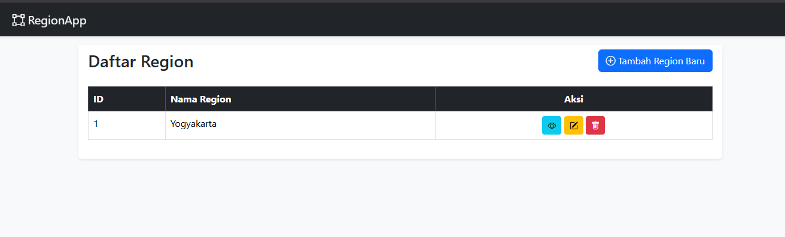
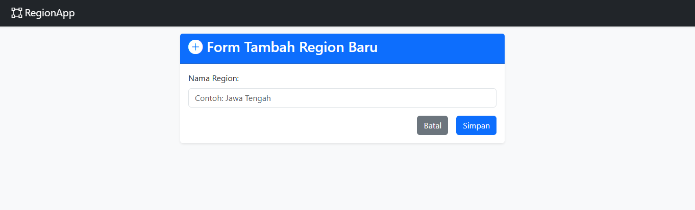
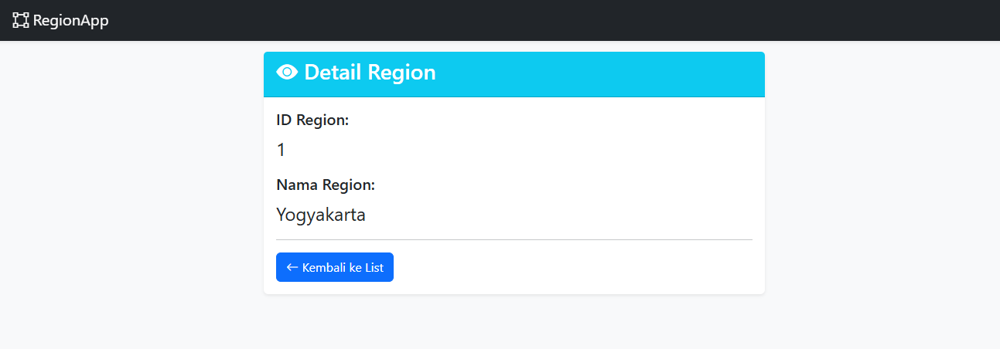
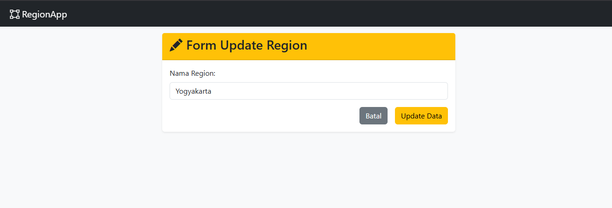
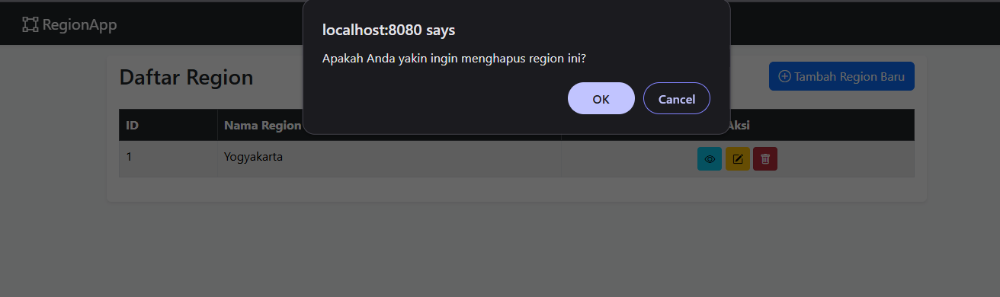

# 🚀 Tugas Bootcamp: CRUD Region (Java Spring Boot + Thymeleaf)

Ini adalah project Spring Boot untuk memenuhi tugas bootcamp, yaitu membuat aplikasi **CRUD (Create, Read, Update, Delete)** untuk data Region.

Aplikasi ini dibangun menggunakan Spring Boot, Spring Data JPA (dengan H2 Database), dan Thymeleaf. Tampilannya dibuat modern dan responsif menggunakan **Bootstrap 5**, **Bootstrap Icons**, dan CSS kustom untuk layout yang bersih.

---

## 💻 Teknologi yang Digunakan

* **Java 21**
* **Spring Boot 3**
* **Spring Data JPA**: Untuk koneksi database.
* **Thymeleaf**: Untuk *template engine* (tampilan HTML).
* **H2 Database**: Database *in-memory* yang ringan untuk development.
* **Maven**: Untuk *dependency management* dan *build* project.
* **Bootstrap 5**: Untuk *framework* CSS modern.
* **Bootstrap Icons**: Untuk ikon-ikon di tombol.

---

## ✨ Fitur Utama

* **Create**: Menambah data region baru melalui form.
* **Read (List)**: Menampilkan semua data region dalam tabel yang rapi di halaman utama.
* **Read (Detail)**: Menampilkan detail satu data region (fungsi `getById`).
* **Update**: Mengedit data region yang sudah ada.
* **Delete**: Menghapus data region, dilengkapi dengan konfirmasi JavaScript.
* **Tampilan Modern**: Semua halaman (List, Tambah, Update, Detail) memiliki Navbar dan *layout* `Card` yang konsisten.

---

## 📸 Screenshot Hasil Aplikasi

Berikut adalah screenshot dari fitur-fitur utama aplikasi:

### 1. Halaman Utama (Daftar Region)
Menampilkan semua data dengan Navbar, Card layout, dan tombol Aksi.

### 2. Halaman Tambah Data
Formulir untuk menambah region baru.

### 3. Halaman Detail (getById)
Tampilan *read-only* untuk satu data region yang dipilih.

### 4. Halaman Update Data
Formulir untuk mengedit data, sudah terisi otomatis dengan data lama.

### 5. Konfirmasi Delete
Peringatan JavaScript yang muncul sebelum menghapus data.

